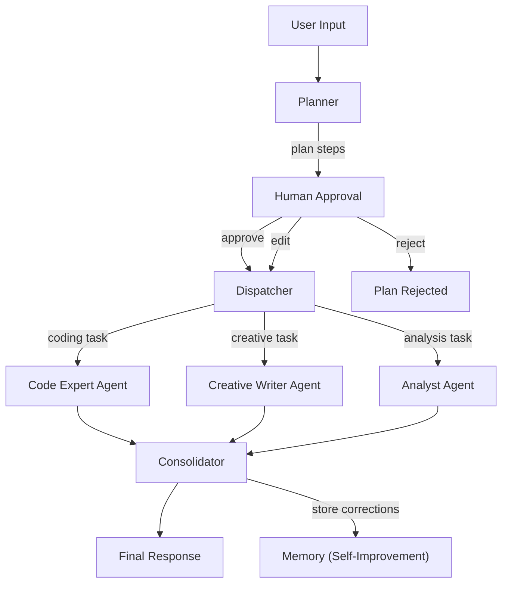

# Multi-Agent Orchestration

klaus uses a **planner + human approval + specialist agents** pattern for complex requests. Instead of routing every message through a single agent, the orchestrator decomposes multi-part requests, presents the plan for human approval, dispatches each sub-task to the best-fit specialist agent, and consolidates results into a unified response. It learns from corrections to improve future plans.

## How It Works



### Pipeline Stages

| Stage | What it does |
|-------|-------------|
| **Planner** | A fast model decomposes the user request into a structured plan — a list of tasks with types, specialist agents, and dependencies |
| **Human Approval** | The plan is presented to the user for approval, rejection, or editing before execution |
| **Dispatcher** | Routes each task to the assigned specialist agent or the best backend/model from routing rules |
| **Executors** | Each task runs as an independent ReAct agent with the specialist's system prompt, preferred model, and relevant tools |
| **Consolidator** | Merges all executor results into a single coherent response |
| **Memory** | Plan corrections are stored in memory and used to improve future plans |

## MD-Based Agents

Specialist agents are defined as simple Markdown files in `data/agents/`:

```markdown
# Agent: Code Expert
A specialist agent for writing, reviewing, and debugging code.

## Capabilities
- coding
- debugging
- code_review

## System Prompt
You are a senior software engineer. Write clean, idiomatic code.
Always include error handling.

## Preferred Model
granite-code:8b

## Preferred Backend
ollama

## Tools
- search_memory
- recall
- remember
```

### Agent File Format

| Section | Required | Description |
|---------|----------|-------------|
| `# Agent: name` | Yes | Agent name (used for assignment in plans) |
| Description text | Yes | What the agent specializes in |
| `## Capabilities` | No | List of task types this agent handles |
| `## System Prompt` | No | Custom system prompt for this agent |
| `## Preferred Model` | No | Model to use (falls back to task routing) |
| `## Preferred Backend` | No | Backend to use |
| `## Tools` | No | Specific tools this agent can use (empty = all tools) |

The planner automatically knows about all loaded agents and can assign them to plan steps.

## Human-in-the-Loop Approval

When the orchestrator creates a plan, it **pauses and waits for approval** before executing:

1. The planner creates a plan with steps, agents, and model assignments
2. The UI displays the plan with **Approve**, **Reject**, and **Edit** buttons
3. The user can:
   - **Approve** — execute the plan as-is
   - **Reject** — cancel the plan (with optional reason)
   - **Edit** — modify step descriptions, remove steps, or reassign agents
4. If no action is taken within 5 minutes, the plan auto-approves

### Editing a Plan

Edit the plan by providing a JSON array of changes:

```json
[
  {"index": 0, "description": "Write Python code using FastAPI"},
  {"index": 2, "remove": true}
]
```

## Self-Improving Plans

Every time a user rejects or edits a plan, the correction is stored in memory with the `plan-correction` tag. When creating future plans, the planner searches for relevant past corrections and includes them in its context.

Over time, this means:
- The planner learns which task decomposition patterns the user prefers
- Repeated corrections for similar requests are applied automatically
- The system adapts to the user's workflow and preferences

Corrections are stored at `/knowledge/plan_corrections/` in the memory tree.

## When is Orchestration Triggered?

The system automatically uses orchestration when **all** of these are true:

1. No explicit backend/model is selected (i.e. "Auto" mode)
2. The message is detected as complex (multiple sentences or multi-task markers like "then", "and also", "additionally")
3. The orchestrator is configured with a task router

Simple single-sentence requests always go through the fast single-agent path.

## Configuration

Add the `orchestrator` section to `config/klaus.yaml`:

```yaml
orchestrator:
  planner_backend: ollama          # Backend for the planner model
  planner_model: qwen3:14b         # Model used for planning and consolidation
  md_tools_dir: data/tools         # Directory for MD-based tool definitions
```

### Configuration Fields

| Field | Default | Description |
|-------|---------|-------------|
| `planner_backend` | `null` (uses default) | Which backend to use for the planner/consolidator |
| `planner_model` | `null` (uses default) | Specific model for planning |
| `md_tools_dir` | `data/tools` | Where to find markdown tool definitions |

## How Task Types Map to Models

The orchestrator uses specialist agents first, then falls back to task routing rules:

1. If a plan step has an assigned **agent** with a preferred model → use that
2. Otherwise, look up the `task_routing` config for the step's task type
3. If the model doesn't support required capabilities → fallback to a capable model

```yaml
task_routing:
  coding:
    preferred_backend: ollama
    preferred_model: granite-code:8b
  creative:
    preferred_backend: ollama
    preferred_model: dolphin-llama3
  reasoning:
    preferred_backend: ollama
    preferred_model: deepseek-r1:32b
```

## UI Experience

### Chat View

When orchestration is active, the chat shows a **live plan visualization**:

- Each plan step appears with its description, task type, assigned agent, and model
- Agent assignments are shown with a purple badge
- **Approval controls** appear below the plan: Approve, Reject, Edit
- Steps transition from pending (circle) to running (spinner) to done (checkmark)
- Once all steps complete, the consolidated response streams below

### Pipeline View

The Pipeline (Flow) page switches to an **orchestrator view** during active orchestration:

- Shows the full graph: Request → Planner → Approval → Dispatcher → Executors → Consolidator → Response
- Executor nodes highlight with their status (pending/running/done)
- Edges animate to show data flow direction

## SSE Events

The orchestrator emits these events via the SSE stream for real-time UI updates:

| Event | Data | When |
|-------|------|------|
| `plan.created` | `{ plan: PlanStep[], agents: AgentInfo[], chat_id }` | After the planner outputs the task list |
| `plan.awaiting_approval` | `{ chat_id }` | Plan is waiting for human approval |
| `plan.approved` | `{ chat_id }` | User approved the plan |
| `plan.rejected` | `{ reason, chat_id }` | User rejected the plan |
| `plan.revised` | `{ plan: PlanStep[], chat_id }` | User edited the plan (new plan attached) |
| `plan.step_start` | `{ index, description, task_type, agent, backend, model, chat_id }` | When an executor begins a task |
| `plan.step_done` | `{ index, result_preview, chat_id }` | When an executor completes |
| `plan.consolidated` | `{ chat_id }` | When the consolidator merges results |

### User Actions (REST)

| Endpoint | Body | Action |
|----------|------|--------|
| `POST /api/events/chat/{id}/plan-action` | `{ "action": "approve" }` | Approve and execute the plan |
| `POST /api/events/chat/{id}/plan-action` | `{ "action": "reject", "reason": "..." }` | Reject the plan |
| `POST /api/events/chat/{id}/plan-action` | `{ "action": "edit", "edits": [...], "reason": "..." }` | Edit the plan |

## Extending the Orchestrator

### Adding New Specialist Agents

Create a new `.md` file in `data/agents/`:

```bash
# Create a new agent
cat > data/agents/security-auditor.md << 'EOF'
# Agent: Security Auditor
Specialist in identifying security vulnerabilities and suggesting fixes.

## Capabilities
- security
- code_review

## System Prompt
You are a security expert. Analyze code and configurations for vulnerabilities.
Focus on OWASP top 10, injection attacks, and authentication weaknesses.

## Preferred Model
qwen3:14b

## Tools
- search_memory
- recall
EOF
```

Restart klaus, and the planner will automatically know about the new agent.

### Programmatic Access

```python
from klaus.agents.md_agents import load_md_agents
from klaus.agents.orchestrator import Orchestrator

agents = load_md_agents("data/agents")

orch = Orchestrator(
    model_registry=registry,
    task_router=router,
    superpowers=superpowers,
    planner_backend="ollama",
    planner_model="qwen3:14b",
    agents=agents,
)

async for event in orch.run(messages=messages, metadata={"chat_id": "123"}):
    print(event)
```
